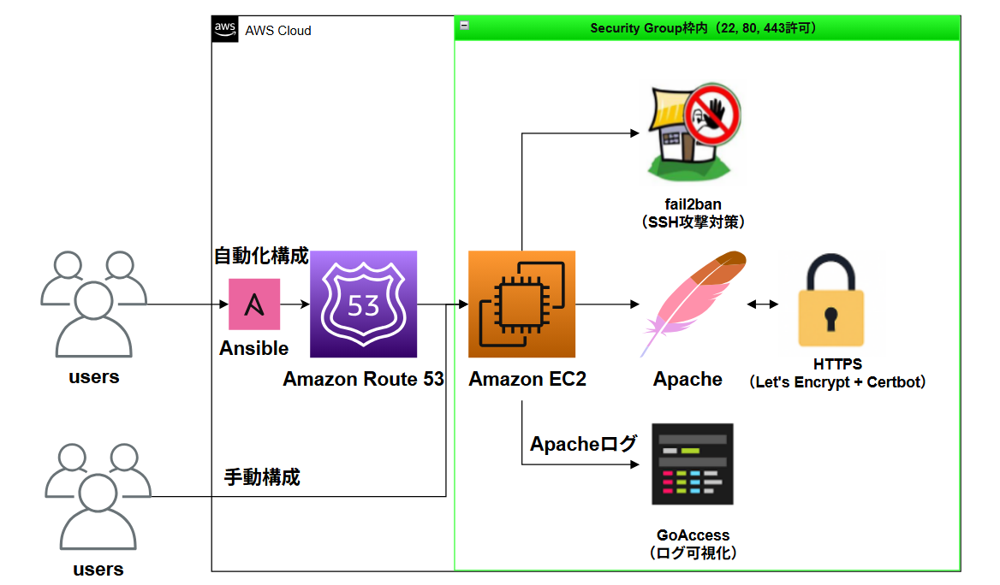

# EC2 + HTTPS サーバ構築ポートフォリオ

## 🔧 Webサイト作成・管理（HTTPS対応）

LPICを勉強して、実際にAWSのサーバ（EC2）でWebサイトを作ってみた記録です。  
できるだけ実務に近い構成を自分で調べながら作りました。

---

## 🗂 サーバ構成図

以下は、Amazon EC2 上に構築した Web サーバの全体構成図です。



---

## 🧩 ハイブリッド構成について

このプロジェクトでは、**Apacheでの動的Webサーバ構築**と、**GitHub Pagesによる静的サイト公開**を組み合わせたハイブリッド構成を採用しています。

- 🔧 **Apache (Amazon Linux + Ansible + Let's Encrypt)**  
  EC2上にApacheを構築し、HTTPS対応・Basic認証・GoAccessによるログ可視化を行う「実運用を想定した動的サーバ」を構築しています。

- 🌐 **GitHub Pages (静的HTML公開)**  
  `docs/` 配下にポートフォリオ用の静的HTMLを配置し、GitHub Pages で即時公開。閲覧用ポートフォリオとして利用しています。

この構成により、**構築・運用のスキル**と**静的サイトとしての表現力**の両面をポートフォリオとして提示できます。

※ `docs/` 配下のHTMLは GitHub Pages により自動公開され、CI/CDの対象ではありません（pushすると即時反映されます）

---

## 🔧 サーバ構築と自動化の構成

### 🛠 開発環境

- Amazon EC2（Amazon Linux 2023）
- Apache（Webサーバ）
- お名前.com で取得した独自ドメイン
- Certbot（Let's Encrypt）でHTTPS化 → 自動更新はcronで実施
- Basic認証（.htpasswd）でログイン制限 → `/secret` のみに適用
- fail2ban（SSHの攻撃対策）→ 5回ログイン失敗で一時BAN
- goaccess（アクセスログのグラフ表示）
- GitHub（コードと設定を管理）

🔸 Ansibleで自動構成していますが、各ツールの動作確認・設定検証はすべて手動でも行っています。  
初めから自動化せず、まず手動構成で動作を理解した上で、自動構成を構築しました。

### ⚙️ 自動化（Ansible + Route 53）

- Ansible：Apache／fail2ban／goaccess／Basic認証を自動構成
- Route 53：Aレコード・NS・SOAなどを自動で管理し、ドメインとEC2を紐づけ

#### ✅ 自動化で実現できること
- Apacheの自動インストール・HTTPS対応（Let's Encrypt）
- fail2banの導入と有効化
- Basic認証の設定（.htpasswd生成）
- goaccessをソースからビルドして可視化ページ生成
- HTTP→HTTPS リダイレクト設定

### 📁 ディレクトリ構成（一部抜粋）

```plaintext
/var/www/html/
├── index.html          # トップページ
├── report.html         # サンプルページ
└── secret/             # Basic認証エリア（.htaccessで制限）

/etc/httpd/
├── conf/               # Apacheのメイン設定（httpd.conf）
├── conf.d/             # HTTPSバーチャルホスト設定
├── conf.modules.d/     # Apacheモジュール構成

/etc/letsencrypt/
├── live/               # 実際に使われる証明書
├── archive/            # 証明書の履歴
├── renewal/            # 自動更新の設定
├── cli.ini             # certbot CLI設定

/etc/fail2ban/
├── jail.d/             # jailルール設定（例：sshd.conf）
├── filter.d/           # フィルタ定義
├── fail2ban.conf       # 本体設定
```

```plaintext
ansible_ec2_setup/
├── site.yml
├── tasks/
│   ├── setup_apache.yml
│   ├── setup_certbot.yml
│   ├── setup_fail2ban.yml
│   ├── setup_htpasswd.yml
│   ├── setup_https_redirect.yml
│   ├── setup_goaccess.yml
│   └── setup_sshd_config.yml
├── files/
│   └── httpd.conf.backup
.github/
└── workflows/
    └── deploy.yml
```

📄 ▶ [Ansible 実行ログを見る](ansible-output.txt)

---

### 🔐 セキュリティの工夫

- HTTPアクセスはすべてHTTPSへ自動リダイレクト
- `.htpasswd` を使って特定ページにログイン制限を設定
- fail2banでSSH攻撃対策（5回失敗でIPブロック）
- セキュリティグループ設定：22, 80, 443番ポートのみ開放
- `/etc/ssh/sshd_config` にて `PermitRootLogin no` 設定済み（rootログイン無効化）
- パスワードログインを無効化（`PasswordAuthentication no`）し、鍵認証のみに限定
- IP直打ちアクセスは403で拒否（FQDNアクセスのみ許可）

---

### 📊 アクセスログの見える化

`goaccess` を使って、ApacheのアクセスログをHTMLでグラフ化しました。  
Webブラウザからアクセス解析の可視化が可能です。

さらに、cronジョブにより `goaccess` を **10分ごとに自動実行**しており、  
`report.html` は常に最新のログ情報に基づいて自動更新されています。

---

## 🚀 CI/CD（継続的インテグレーション & デプロイ）

GitHub Actions を使って、以下のような CI/CDパイプラインを構築しています。

### ✅ 流れ
- 自動でワークフローが起動（CI）
- GitHub Actions が構成エラー（Ansibleの構文や設定ミス）をチェック
- 問題がなければ EC2 に SSH 接続（CD）
- `ansible-playbook` を実行し、構成が本番サーバに即時反映

---

## 🔗 関連リンク

- 💻 ポートフォリオ（GitHub Pages）  
  https://infra-startup.github.io/ec2-https-webserver/

- 📘 GitHubリポジトリ  
  https://github.com/infra-startup/ec2-https-webserver

- 📊 GoAccess レポートページ  
  https://infra-startup.github.io/ec2-https-webserver/report.html

- 🔒 Apache Basic認証ページ（開発環境用）  
  ※アクセスにはユーザー名とパスワードが必要です  
  https://mytest-portfolio.xyz/secret/

