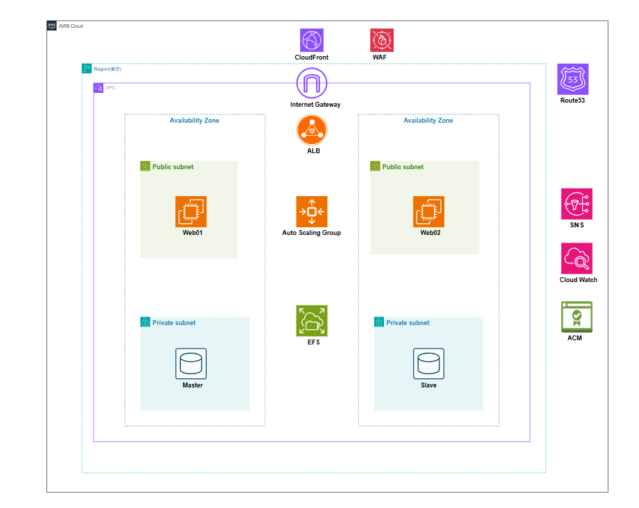

# AWS インフラ構成ポートフォリオ

このリポジトリは、AWS上に構築した本番環境を想定したLinux + Apacheによる動的Webサーバ構成の学習成果をまとめたものです。
Auto Scaling、RDS、EFS、ALB、WAF、IAM、CloudWatchなどを組み合わせ、高可用性・セキュリティ・拡張性を意識したインフラ構築を実践しました。

当初は静的サーバ構成（AnsibleやGoAccessを利用）から学習を始め、WordPressによる動的サーバ構築も行いましたが、動的運用はコストや可用性の観点からポートフォリオには向かないと判断し、今回のようなLinux + Apache構成での高可用環境を実現しています。

🔗 [自己紹介ページ（GitHub Pages）はこちら](https://infra-startup.github.io/aws-dynamic-server-portfolio/)

---

## 📊 インフラ構成図

構成図は draw.io（diagrams.net）で作成し、全体像を視覚的に整理しています。

---

## 🧱 構成要素

| サービス      | 役割・目的 |
|---------------|------------|
| EC2（Auto Scaling） | Webアプリケーションのホスティング／スケーラブルな構成 |
| RDS           | WordPress用MySQL／マルチAZ構成 |
| ALB           | 負荷分散／スケールイン・アウト対応 |
| EFS           | Webサーバ間のファイル共有と永続化 |
| ACM           | SSL証明書管理／HTTPS対応 |
| IAM           | サービス間アクセス制御／最小権限設定 |
| CloudWatch    | リソース監視とアラーム通知 |
| WAF + CloudFront | 不正アクセス防止／高速化・キャッシュ処理 |
| Route53       | 独自ドメインのDNS管理とヘルスチェック |

---

## 🌟 特徴

- Auto Scaling + マルチAZによる高可用性と拡張性の両立
- CloudWatchアラームとSNS通知による障害検知
- AMIによる構成のイメージ化で、同一環境の再構築を迅速に実現
- WAF・IAM・セキュリティグループによる多層的なアクセス制御
- EFSによりWebサーバ間の一貫性を保持

---

## 🧠 実践的な学習と運用体験

- CloudWatchアラームをきっかけに `df` や `top` コマンドを使ってリソース負荷を調査し、初動対応の流れを体験
- draw.io による構成図作成を通じて学習内容を整理し、他者にも伝わるアウトプットを重視しました。
- また、静的構成から動的構成への移行を通じて、冗長化・拡張性を考慮した設計の重要性を学びました。

---

## 🧩 設計の意図と工夫

未経験からのインフラ学習として、「読みやすさ」「再現性」「基礎理解の定着」を重視し、シンプルなポートフォリオになっています。  
手動で構築・検証することで、各サービスの関係性と挙動を段階的に理解することに注力しました。

---

## 🚀 今後の展望

- LPIC-2の学習・資格取得

---

### 📸 スクリーンショット一覧

アラームや証明書などの動作確認の証拠として、以下のスクリーンショットを `docs/images/` フォルダに格納しています。

- `cloudwatch-device-alarm.png`：CPU、メモリ、ディスク使用率に対するアラーム
- `cloudwatch-alarm-auto-scaling.png`：Auto Scaling のトリガーとして設定したアラーム
- `https-cert-valid.png`：HTTPS証明書が正常に適用されていることを示す画面

---
## 📫 お問い合わせ

ポートフォリオに関するご質問・ご連絡は下記までお願いいたします。

📧 maeno.portfolio@gmail.com

