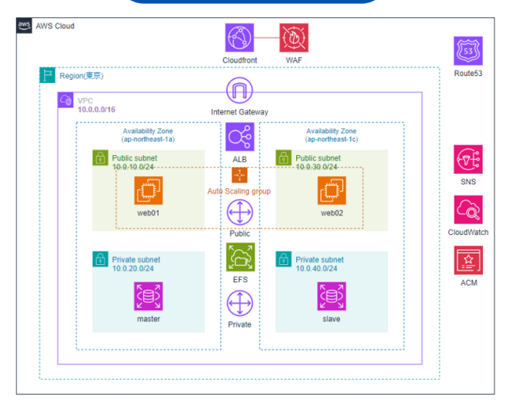

# AWS インフラ構成ポートフォリオ（動的サーバー）

本リポジトリでは、AWS上に構築した**本番環境を想定した動的Webサーバ構成**をまとめています。  
ALB、RDS、EFS、IAM、CloudWatch、WAF などを活用し、**可用性・自動化・セキュリティ**を意識したインフラ設計を実践しています。

---

## ✅ 構成図

---

## ✅ 構成要素

| カテゴリ | 内容 |
|----------|------|
| VPC構成 | 2つのAZにパブリック／プライベートサブネットを分離し構成 |
| EC2 | Auto Scaling GroupでWeb01/Web02を冗長化 |
| ALB | アクセスによる負荷分散 |
| RDS | マルチAZ |
| EFS | Webサーバ間でファイル共有 |
| CloudFront + WAF | キャッシュ・攻撃防御による高速化とセキュリティ対策 |
| CloudWatch | アラーム・ログ監視による障害検知と通知 |
| AMI | サーバ構成をテンプレート化して再現性を確保 |
| Route53 | 独自ドメインでDNS管理（可用性検証込み） |

---

## ✅ 特徴

- **冗長構成**：Auto Scaling・マルチAZ構成で高可用性を実現
- **障害対応の自動化**：CloudWatchアラームからSNS通知
- **セキュリティ対策**：WAF, セキュリティグループ、IAMロール管理
- **スケーラブル設計**：必要に応じてオートスケール可能な構成
- **構成の再現性**：AMIによって同一構成を素早く立ち上げ可能

---

## ✅ 学習背景と狙い

当初は静的サーバ構成（AnsibleやGoAccess等）からスタートしましたが、学習の進展に合わせてより*実務に近い動的インフラ構成**へと発展させました。

> 「再現性・拡張性・セキュリティを重視したインフラを、自動化と設計を通して表現する」  
という目的で構成全体を設計しています。

---

## 🔗 関連リンク

- 💻 ポートフォリオ（GitHub Pages）  
  https://infra-startup.github.io/aws-dynamic-server-portfolio/

- 📘 GitHubリポジトリ  
  https://github.com/infra-startup/aws-dynamic-server-portfolio